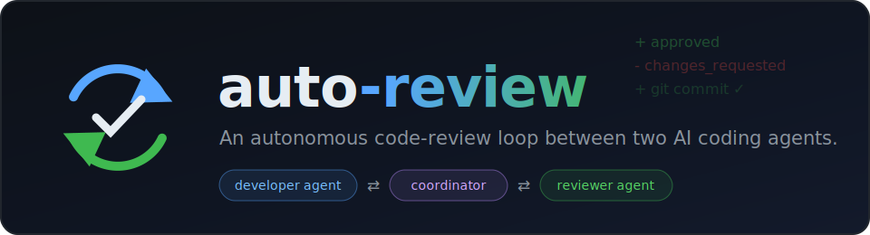
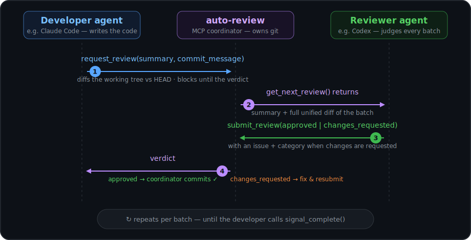

<div align="center">



<br/><br/>

[](https://www.npmjs.com/package/@permissionbrick/auto-review-mcp)
[](package.json)
[](LICENSE)
[](https://modelcontextprotocol.io)

**[Quick start](#quick-start)** · [How it works](docs/how-it-works.md) · [Configuration](docs/configuration.md) · [Using Codex](docs/codex.md)

</div>

---

**auto-review** is a local MCP server that runs a continuous review loop between two coding
agents — one **developer**, one **reviewer** — with no human in the middle. Every batch of changes
is diffed, reviewed, and only committed once approved.

The point is to split development and review across **different agents** — ideally different
harnesses, models, and subscriptions — so the code is never reviewed with the same biases that
wrote it. For example: Claude Code (Opus 4.8) as the developer and Codex (GPT 5.5) as the reviewer,
each on its own subscription.

## Quick start

**Nothing to install.** Add this one block to each agent's MCP config — it's fetched and run on
demand via `npx`:

```jsonc
{
  "mcpServers": {
    "auto-review": {
      "command": "npx",
      "args": ["-y", "@permissionbrick/auto-review-mcp"],
      "env": { "AUTO_REVIEW_POLL_SECONDS": "240", "AUTO_REVIEW_WAIT_SECONDS": "600" },
      "timeout": 1800000
    }
  }
}
```

This block exposes both toolsets, so the same config works for both agents. Launch two of them
pointed at the same git repo, tell one it's the **developer** and the other the **reviewer**, and
you're done — the tools are self-describing, so the prompts stay short:

<summary><b>Suggested prompts</b>
<br/>

**Developer:**

> Implement this and review it using the auto-review tool.

**Reviewer:**

> Start an auto-review tool loop as the reviewer.


## The loop

<div align="center">

</div>

1. The developer finishes a batch and calls `request_review` — the coordinator stages everything,
   diffs the working tree vs HEAD, and blocks the developer.
2. The reviewer's pending `get_next_review` wakes instantly with the summary and the full diff.
3. The reviewer rules via `submit_review`: `approved`, or `changes_requested` with a concrete issue.
4. On approval **the server commits** (with the developer's message and a `Reviewed-by` trailer);
   on rejection the issue is forwarded and the developer fixes and resubmits.

The protocol is taught entirely through the MCP tool descriptions, so the agents self-orchestrate —
details in [How it works](docs/how-it-works.md).

## Features

- **Zero install** — one `npx` line per agent; the first proxy auto-starts the shared coordinator.
- **Cross-model review** — pair different harnesses/models for developer and reviewer to avoid
  shared blind spots.
- **Self-orchestrating** — the protocol lives in the tool descriptions; prompts stay two sentences.
- **Instant, event-driven handoffs** — blocking calls, no polling burn; waits are effectively
  unbounded and survive client timeouts and connection drops.
- **Server-owned commits** — every approved batch becomes a clean commit; the developer never runs
  `git commit`.
- **Two transports** — stdio proxy (recommended, zero setup) or a manually started HTTP server for
  remote agents.
- **Works with Claude Code and Codex** — including a shell-command fallback for Codex's hard ~120 s
  tool-call ceiling.

## Configuration

The defaults work out of the box. The knobs you're most likely to touch:

| Setting | Default | What it does |
|---|---|---|
| `--role` / `AUTO_REVIEW_ROLE` | *(all tools)* | Pin an agent to `developer` or `reviewer`. |
| `AUTO_REVIEW_WAIT_SECONDS` | `600` | How long one agent-visible call waits before `keep_waiting`. |
| `AUTO_REVIEW_POLL_SECONDS` | `240` | Internal long-poll hold — keep ≤ ~270 s. |
| `--repo` / `AUTO_REVIEW_REPO` | *(set at runtime)* | Pre-set the target repo instead of `initialize_review_session`. |
| `timeout` (in `.mcp.json`) | `1800000` | Claude Code's per-call cap; must exceed the wait window. |

Full reference — all flags, the HTTP transport, and how the wait/poll/timeout windows interact —
in [Configuration](docs/configuration.md).

## Verify it works

End-to-end demos spin up a throwaway git repo and drive the full loop
(keep_waiting → submit → review → changes_requested → fix → approve → commit → complete):

```bash
npm install          # builds via the prepare script
npm run demo         # HTTP path: two SDK clients against a running server
npm run demo:stdio   # node/stdio path: two spawned proxies + auto-started coordinator
npm run demo:cli     # shell poll-command path: MCP for instant ops + cli.js for the blocking wait
```

Each prints a checklist and exits non-zero if anything fails.

## Documentation

| | |
|---|---|
| [How it works](docs/how-it-works.md) | Roles, the protocol, blocking handoffs, server-owned commits, limitations |
| [Configuration](docs/configuration.md) | Connecting agents (stdio/HTTP), all flags & env vars, tuning wait windows |
| [Using Codex](docs/codex.md) | Codex setup, the ~120 s ceiling, the shell poll command |

## License

[MIT](LICENSE) © permissionBRICK
